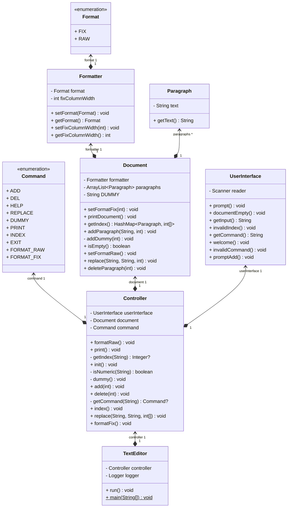

```mermaid
classDiagram
direction BT
class Command {
<<enumeration>>
  +  ADD
  +  DEL
  +  HELP
  +  REPLACE
  +  DUMMY
  +  PRINT
  +  INDEX
  +  EXIT
  +  FORMAT_RAW
  +  FORMAT_FIX
}
class Controller {
  - UserInterface userInterface
  - Document document
  - Command command
  + formatRaw() void
  + print() void
  - getIndex(String) Integer?
  + init() void
  - isNumeric(String) boolean
  - dummy() void
  + add(int) void
  + delete(int) void
  - getCommand(String) Command?
  + index() void
  + replace(String, String, int[]) void
  + formatFix() void
}
class Document {
  - Formatter formatter
  - ArrayList~Paragraph~ paragraphs
  - String DUMMY
  + setFormatFix(int) void
  + printDocument() void
  + getIndex() HashMap~Paragraph, int[]~
  + addParagraph(String, int) void
  - addDummy(int) void
  + isEmpty() boolean
  + setFormatRaw() void
  + replace(String, String, int) void
  + deleteParagraph(int) void
}
class Format {
<<enumeration>>
  +  FIX
  +  RAW
}
class Formatter {
  - Format format
  - int fixColumnWidth
  + setFormat(Format) void
  + getFormat() Format
  + setFixColumnWidth(int) void
  + getFixColumnWidth() int
}
class Paragraph {
  - String text
  + getText() String
}
class TextEditor {
  - Controller controller
  - Logger logger
  + run() void
  + main(String[])$ void
}
class UserInterface {
  - Scanner reader
  + prompt() void
  + documentEmpty() void
  + getInput() String
  + invalidIndex() void
  + getCommand() String
  + welcome() void
  + invalidCommand() void
  + promptAdd() void
}

Controller "1" *--> "command 1" Command 
Controller "1" *--> "document 1" Document 
Controller "1" *--> "userInterface 1" UserInterface 
Document "1" *--> "formatter 1" Formatter 
Document "1" *--> "paragraphs *" Paragraph 
Formatter "1" *--> "format 1" Format 
TextEditor "1" *--> "controller 1" Controller 
```
